# Microsoft Agents SDK - Package Dependencies

This document describes the internal package dependencies within the Microsoft Agents SDK libraries.

## Dependency Diagram

```mermaid
graph TD
    subgraph Core["Core Layer"]
        Core_Pkg["Microsoft.Agents.Core"]
        Core_Analyzers["Microsoft.Agents.Core.Analyzers"]
        Auth["Microsoft.Agents.Authentication"]
    end

    subgraph Authentication["Authentication Layer"]
        Auth_Msal["Microsoft.Agents.Authentication.Msal"]
    end

    subgraph Storage["Storage Layer"]
        Storage_Pkg["Microsoft.Agents.Storage"]
        Storage_Blobs["Microsoft.Agents.Storage.Blobs"]
        Storage_Cosmos["Microsoft.Agents.Storage.CosmosDb"]
        Storage_Transcript["Microsoft.Agents.Storage.Transcript"]
    end

    subgraph Client["Client Layer"]
        Connector["Microsoft.Agents.Connector"]
        Client_Pkg["Microsoft.Agents.Client"]
        CopilotStudio["Microsoft.Agents.CopilotStudio.Client"]
    end

    subgraph Builder["Builder Layer"]
        Builder_Pkg["Microsoft.Agents.Builder"]
        Builder_Dialogs["Microsoft.Agents.Builder.Dialogs"]
    end

    subgraph Hosting["Hosting Layer"]
        Hosting_AspNet["Microsoft.Agents.Hosting.AspNetCore"]
        Hosting_A2A["Microsoft.Agents.Hosting.AspNetCore.A2A"]
    end

    subgraph Extensions["Extensions Layer"]
        Ext_Teams["Microsoft.Agents.Extensions.Teams"]
        Ext_SharePoint["Microsoft.Agents.Extensions.SharePoint"]
        Ext_TeamsAI["Microsoft.Agents.Extensions.Teams.AI"]
    end

    %% Core dependencies
    Auth --> Core_Pkg

    %% Authentication layer
    Auth_Msal --> Auth

    %% Storage layer
    Storage_Pkg --> Core_Pkg
    Storage_Blobs --> Storage_Pkg
    Storage_Cosmos --> Storage_Pkg
    Storage_Transcript --> Core_Pkg

    %% Client layer
    Connector --> Auth
    Connector --> Core_Pkg
    CopilotStudio --> Core_Pkg
    Client_Pkg --> Builder_Pkg
    Client_Pkg --> Auth
    Client_Pkg --> Core_Pkg
    Client_Pkg --> Storage_Pkg

    %% Builder layer
    Builder_Pkg --> Connector
    Builder_Pkg --> Auth
    Builder_Pkg --> Core_Pkg
    Builder_Pkg --> Storage_Transcript
    Builder_Pkg --> Storage_Pkg
    Builder_Dialogs --> Client_Pkg
    Builder_Dialogs --> Builder_Pkg

    %% Hosting layer
    Hosting_AspNet --> Builder_Pkg
    Hosting_A2A --> Hosting_AspNet

    %% Extensions layer
    Ext_Teams --> Builder_Pkg
    Ext_Teams --> Connector
    Ext_Teams --> Core_Pkg
    Ext_SharePoint --> Builder_Pkg
    Ext_SharePoint --> Core_Pkg
    Ext_TeamsAI --> Builder_Pkg
    Ext_TeamsAI --> Ext_Teams

    %% Styling
    classDef core fill:#e1f5fe,stroke:#01579b
    classDef auth fill:#fff3e0,stroke:#e65100
    classDef storage fill:#e8f5e9,stroke:#1b5e20
    classDef client fill:#fce4ec,stroke:#880e4f
    classDef builder fill:#f3e5f5,stroke:#4a148c
    classDef hosting fill:#fff8e1,stroke:#ff6f00
    classDef extensions fill:#e0f2f1,stroke:#004d40

    class Core_Pkg,Core_Analyzers,Auth core
    class Auth_Msal auth
    class Storage_Pkg,Storage_Blobs,Storage_Cosmos,Storage_Transcript storage
    class Connector,Client_Pkg,CopilotStudio client
    class Builder_Pkg,Builder_Dialogs builder
    class Hosting_AspNet,Hosting_A2A hosting
    class Ext_Teams,Ext_SharePoint,Ext_TeamsAI extensions
```

## Package Dependency Summary

| Package | Depends On |
|---------|-----------|
| **Microsoft.Agents.Core.Analyzers** | *(none - standalone analyzer)* |
| **Microsoft.Agents.Core** | *(base package)* |
| **Microsoft.Agents.Authentication** | Core |
| **Microsoft.Agents.Authentication.Msal** | Authentication |
| **Microsoft.Agents.Storage** | Core |
| **Microsoft.Agents.Storage.Blobs** | Storage |
| **Microsoft.Agents.Storage.CosmosDb** | Storage |
| **Microsoft.Agents.Storage.Transcript** | Core |
| **Microsoft.Agents.Connector** | Authentication, Core |
| **Microsoft.Agents.CopilotStudio.Client** | Core |
| **Microsoft.Agents.Builder** | Connector, Authentication, Core, Storage, Storage.Transcript |
| **Microsoft.Agents.Client** | Builder, Authentication, Core, Storage |
| **Microsoft.Agents.Builder.Dialogs** | Client, Builder |
| **Microsoft.Agents.Hosting.AspNetCore** | Builder |
| **Microsoft.Agents.Hosting.AspNetCore.A2A** | Hosting.AspNetCore |
| **Microsoft.Agents.Extensions.Teams** | Builder, Connector, Core |
| **Microsoft.Agents.Extensions.SharePoint** | Builder, Core |
| **Microsoft.Agents.Extensions.Teams.AI** | Builder, Extensions.Teams |

## Layer Descriptions

### Core Layer
The foundational packages that provide base types, interfaces, and authentication abstractions.

- **Microsoft.Agents.Core** - Base types, Activity model, and core interfaces
- **Microsoft.Agents.Core.Analyzers** - Roslyn analyzers for code quality
- **Microsoft.Agents.Authentication** - Authentication abstractions and JWT validation

### Authentication Layer
Extended authentication implementations.

- **Microsoft.Agents.Authentication.Msal** - MSAL-based authentication provider

### Storage Layer
State persistence and transcript storage implementations.

- **Microsoft.Agents.Storage** - Storage abstractions and in-memory implementation
- **Microsoft.Agents.Storage.Blobs** - Azure Blob Storage implementation
- **Microsoft.Agents.Storage.CosmosDb** - Azure Cosmos DB implementation
- **Microsoft.Agents.Storage.Transcript** - Transcript logging storage

### Client Layer
HTTP clients for communicating with Azure Bot Service and other agents.

- **Microsoft.Agents.Connector** - ConnectorClient and UserTokenClient
- **Microsoft.Agents.Client** - Agent-to-agent communication
- **Microsoft.Agents.CopilotStudio.Client** - Direct-to-Engine client for Copilot Studio

### Builder Layer
High-level APIs for building agents.

- **Microsoft.Agents.Builder** - AgentApplication, TurnContext, and activity handlers
- **Microsoft.Agents.Builder.Dialogs** - Dialog system for multi-turn conversations

### Hosting Layer
ASP.NET Core integration for hosting agents.

- **Microsoft.Agents.Hosting.AspNetCore** - ASP.NET Core middleware and controllers
- **Microsoft.Agents.Hosting.AspNetCore.A2A** - Agent-to-Agent protocol hosting (Preview)

### Extensions Layer
Platform-specific extensions.

- **Microsoft.Agents.Extensions.Teams** - Microsoft Teams-specific features
- **Microsoft.Agents.Extensions.SharePoint** - SharePoint-specific features
- **Microsoft.Agents.Extensions.Teams.AI** - AI capabilities for Teams agents
